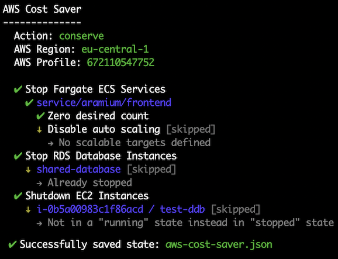

aws-cost-saver
=======================

A tiny CLI tool to help save costs in development environments when you're asleep and don't need them!

* [Usage](#usage)
* [Tricks](#tricks)
  * [shutdown-ec2-instances](#-shutdown-ec2-instances)
  * [stop-fargate-ecs-services](#-stop-fargate-ecs-services)
  * [stop-rds-databases](#-stop-rds-databases)
  * [decrease-dynamodb-provisioned-rcu-wcu](#-decrease-dynamodb-provisioned-rcu-wcu)

### Disclaimer
This utility is meant for **development** environments only where stopping and removing resources is not risky.

# Usage
```sh-session
$ npm install -g aws-cost-saver
```
## Commands
Under the hood [aws-sdk](https://github.com/aws/aws-sdk-js) is used, therefore AWS Credentials are read in this order:
1. From `AWS_ACCESS_KEY_ID`, `AWS_SECRET_ACCESS_KEY` and `AWS_REGION` environment variables.
2. From shared ini file (i.e. `~/.aws/credentials`)

### Conserve

This command uses [various tricks](#tricks) to conserve as much money as possible. To be able to [restore](#restore), this command will create a `state-file`.

```
USAGE
  $ aws-cost-saver conserve [-d|--dry-run] [-s|--state-file aws-cost-saver.json] [-i|--no-state-file] [-r|--region eu-central-1] [-p|--profile default]

OPTIONS
  -h, --help            Show CLI help.
  -d, --dry-run         Only list actions and do not actually execute them.
  -s, --state-file      (default: aws-cost-saver.json) Path to save current state of your AWS resources.
  -n, --no-state-file   (default: false) Do not keep original state, just conserve as much money as possible.
  -r, --region          (default: eu-central-1) AWS region to look up and save resoruces.
  -p, --profile         (default: default) AWS profile to lookup from ~/.aws/config
```

<p align="center">
  
</p>

### Restore

To restore AWS resources stopped or removed by the [conserve](#conserve) command.

```
USAGE
  $ aws-cost-saver restore [-d|--dry-run] [-s|--state-file aws-cost-saver.json] [-r|--region eu-central-1] [-p|--profile default]

OPTIONS
  -h, --help             Show CLI help.
  -d, --dry-run          Only list actions and do not actually execute them.
  -s, --state-file       (default: aws-cost-saver.json) Path to load previous state of your AWS resources from.
  -r, --region           (default: eu-central-1) AWS region to restore resoruces in.
  -p, --profile          (default: default) AWS profile to lookup from ~/.aws/config
```

# Tricks
Here is a list of tricks aws-cost-saver uses to reduce AWS costs when you don't need them.

### # shutdown-ec2-instances
Stopping running EC2 instances will save compute-hour. This trick will keep track of stopped EC2 instances in the state-file and start them again on restore.

### # stop-fargate-ecs-services
Stopping AWS Fargate ECS services (i.e. tasks) will save compute-hour. This trick will keep track of stopped Fargate ECS services in the state-file and start them again on restore.

### # stop-rds-databases
Stopping RDS databases will save underlying EC2 instance costs. This trick will keep track of stopped databases in the state-file and start them again on restore.

### # decrease-dynamodb-provisioned-rcu-wcu
Provisioned RCU and WCU on DynamoDB tables costs hourly. This trick will decrease them to minimum value (i.e. 1). Original values will be stored in state-file to be restored later.

### # TODO
If you know about other tricks that can help developers community to save some money feel free to create a Pull Request or raise an issue.

# Alternatives
There are various ways to save money on AWS that need per-case judgement and it'll be hard to generalize into aws-cost-saver, but here is a list of useful resources:
* [Google Search: "aws cost saving"](https://lmgtfy.com/?q=aws+cost+saving)
* [Use Amazon EC2 Spot Instances to reduce EC2 costs for background and non-critical services](https://www.youtube.com/watch?v=7q5AeoKsGJw)
* [Delete idle LBs, Use private subnets, Use auto-scalers, etc.](https://medium.com/@george_51059/reduce-aws-costs-74ef79f4f348)

# License
[](https://opensource.org/licenses/MIT)  

AWS Cost Saver is licensed under MIT License. See [LICENSE](LICENSE) for the full license text.
